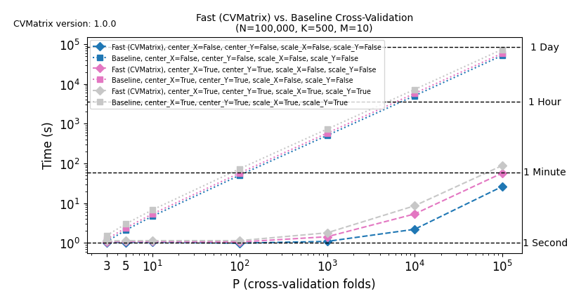

# CVMatrix

[](https://pypi.python.org/pypi/cvmatrix/)

[](https://pypi.python.org/pypi/cvmatrix/)

[](https://pypi.python.org/pypi/cvmatrix/)

[](https://pypi.python.org/pypi/cvmatrix/)

[](https://cvmatrix.readthedocs.io/en/latest/?badge=latest)

[](https://github.com/Sm00thix/CVMatrix/actions/workflows/workflow.yml)

The [`cvmatrix`](https://pypi.org/project/cvmatrix/) package implements the fast algorithms by Engstrøm [[1]](#references) for computation of training set $\mathbf{X}^{\mathbf{T}}\mathbf{X}$ and $\mathbf{X}^{\mathbf{T}}\mathbf{Y}$ in a cross-validation setting. In addition to correctly handling arbitrary row-wise pre-processing, the algorithms allow for and efficiently and correctly handle any combination of column-wise centering and scaling of `X` and `Y` based on training set statistics.

For an implementation of the fast cross-validation algorithms combined with Improved Kernel Partial Least Squares [[2]](#references), see the Python package [`ikpls`](https://pypi.org/project/ikpls/).

## Installation

- Install the package for Python3 using the following command:
    ```shell
    pip3 install cvmatrix
    ```

- Now you can import the class implementing all the algorithms with:
    ```python
    from cvmatrix.cvmatrix import CVMatrix
    ```

## Quick Start

### Use the cvmatrix package for fast computation of training set kernel matrices

> ```python
> import numpy as np
> from cvmatrix.cvmatrix import CVMatrix
>
> N = 100  # Number of samples.
> K = 50  # Number of features.
> M = 10  # Number of targets.
>
> X = np.random.uniform(size=(N, K)) # Random X data
> Y = np.random.uniform(size=(N, M)) # Random Y data
> cv_splits = np.arange(100) % 5 # 5-fold cross-validation
>
> # Instantiate CVMatrix
> cvm = CVMatrix(
>     cv_splits=cv_splits,
>     center_X=True,
>     center_Y=True,
>     scale_X=True,
>     scale_Y=True,
> )
> # Fit on X and Y
> cvm.fit(X=X, Y=Y)
> # Compute training set XTX and/or XTY for each fold
> for val_split in cvm.val_folds_dict.keys():
>     # Get both XTX and XTY
>     training_XTX, training_XTY = cvm.training_XTX_XTY(val_split)
>     # Get only XTX
>     training_XTX = cvm.training_XTX(val_split)
>     # Get only XTY
>     training_XTY = cvm.training_XTY(val_split)

### Examples
In [examples](https://github.com/Sm00thix/CVMatrix/tree/main/examples), you will find:

- [Compute training matrices with CVMatrix](https://github.com/Sm00thix/CVMatrix/tree/main/examples/training_matrices.py)

## Benchmarks

In [benchmarks](https://github.com/Sm00thix/CVMatrix/tree/main/benchmarks), we have benchmarked the fast algorithms in [`cvmatrix`](https://pypi.org/project/cvmatrix/) against the straight-forward, naive algorithms implemented in [NaiveCVMatrix](https://github.com/Sm00thix/CVMatrix/tree/main/tests/naive_cvmatrix.py).

<p align=center>
    
   <br>
   <em> <strong>Left:</strong> Benchmarking the CVMatrix implementation versus the straight-forward, naive implementation (NaiveCVMatrix) using three common combinations of centering and scaling. <strong>Right:</strong> Benchmarking the CVMatrix implementation for all possible combinations of centering and scaling. </em>
</p>

## Contribute

To contribute, please read the [Contribution
Guidelines](https://github.com/Sm00thix/CVMatrix/blob/main/CONTRIBUTING.md).

## References

1. [Engstrøm, O.-C. G. (2024). Shortcutting Cross-Validation: Efficiently Deriving Column-Wise Centered and Scaled Training Set $\mathbf{X}^\mathbf{T}\mathbf{X}$ and $\mathbf{X}^\mathbf{T}\mathbf{Y}$ Without Full Recomputation of Matrix Products or Statistical Moments](https://arxiv.org/abs/2401.13185)
2. [Dayal, B. S., & MacGregor, J. F. (1997). Improved PLS algorithms. *Journal of Chemometrics*, 11(1), 73-85.](https://doi.org/10.1002/(SICI)1099-128X(199701)11:1%3C73::AID-CEM435%3E3.0.CO;2-%23?)