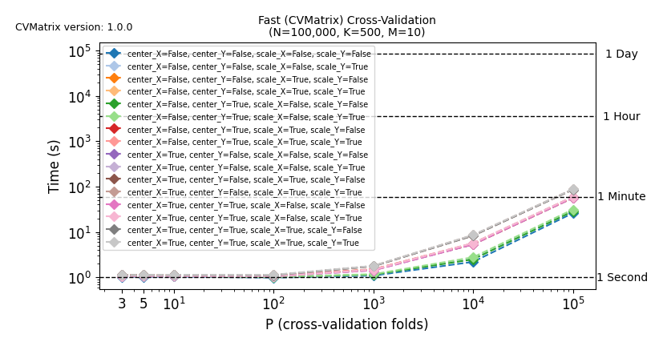

# Benchmarks

This README describes how we benchmarked computation of trianing set $\mathbf{X}^{\mathbf{T}}\mathbf{X}$ and $\mathbf{X}^{\mathbf{T}}\mathbf{Y}$ using the fast algorithms implemented in the [`cvmatrix`](https://pypi.org/project/cvmatrix/) package, against the naive algorithms. Both the fast and naive algorithms are described in [[1]](#references). We also describe how you can reproduce the benchmarks on your own machine in [Running your own benchmarks](#running-your-own-benchmarks).

The repository comes with benchmarks on a single thread on an AMD Ryzen 9 5950X using DDR4, 3.2GHz, C16 RAM. These benchmarks generated and saved in `benchmark_results.csv` by executing:
```shell
python3 benchmark.py
```
 
The benchmarks made use of the following random X and Y matrices to perform P-fold cross-validation with all $P \in \{3, 5, 10, 100, 1000, 10000, 100000\}$.
```python
seed = 42 # Seed for reproducibility
rng = np.random.default_rng(seed=seed)
N = 100000 # 100k samples
K = 500 # 500 features
M = 10 # 10 targets
dtype = np.float64 # Data type
X = rng.random((N, K), dtype=dtype) # Random X matrix
Y = rng.random((N, M), dtype=dtype) # Random Y matrix
```

We benchmarked the fast algorithm using all 16 combinations of `center_X`, `center_Y`, `scale_X`, and `scale_Y`. In the interest of time, the naive algorithm was only benchmarked for 3 of the 16 combinations, namely:
1. ```python
   center_X=center_Y=scale_X=scale_Y=False
   ```
2. ```python
   center_X=center_Y=True
   scale_X=scale_Y=False
   ```
3. ```python
   center_X=center_Y=scale_X=scale_Y=True
   ```

The benchmarks have been visualized in `benchmark_cvmatrix.png` and `benchmark_cvmatrix_vs_naive.png`, generated with:
```shell
python3 plot_benchmark.py
```

<p align=center>
    
   <br>
   <em> Left: Benchmarking the CVMatrix implementation versus the straight-forward, naive implementation (NaiveCVMatrix) using three common combinations of centering and scaling. Right: Benchmarking the CVMatrix implementation for all possible combinations of centering and scaling. </em>
</p>

## Running your own benchmarks

To plot the benchmarks, you need to install `pandas` and `matplotlib`:

```shell
pip3 install pandas matplotlib
```

Execute the following commands to generate the benchmark. Note, that this starts with a deletion of the provided benchmarks in `benchmark_results.csv` and ends with an overwrite of the provided plots in `benchmark_cvmatrix.png` and `benchmark_cvmatrix_vs_naive.png`.
```shell
rm benchmark_results.csv
python3 benchmark.py
python3 plot_benchmark.py
```

## References

1. [Engstrøm, O.-C. G. (2024). Shortcutting Cross-Validation: Efficiently Deriving Column-Wise Centered and Scaled Training Set $\mathbf{X}^\mathbf{T}\mathbf{X}$ and $\mathbf{X}^\mathbf{T}\mathbf{Y}$ Without Full Recomputation of Matrix Products or Statistical Moments](https://arxiv.org/abs/2401.13185)